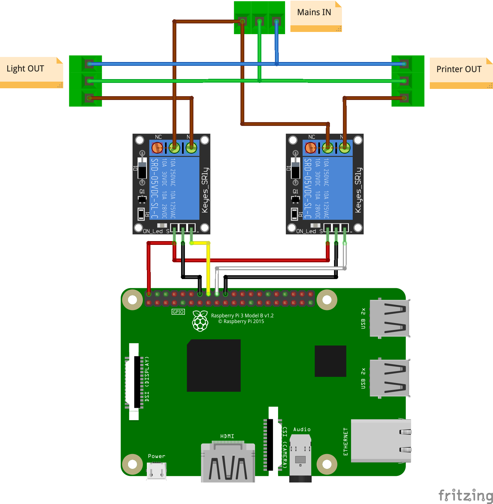

Autoprint plugin design concept
===============================

Requirements
===============================

Use Cases
-------------------------------

1. Enable the remote powering on/off of a printer and a light above the printer via two distinct
   GPIO pins (which are most likely connected to relais) - also exposing these GPIOs
2. Automatically disconnect and turn off the printer after a print is finished - with the option
   to wait for a proper cool down
3. Start the printer and begin printing a specific file either at a given time or at a time
   so that the print will be finished as specified 

Detailed considerations
-------------------------------

- The GPIO pins must be configurable in order to change the HW design
- The cooldown nozzle temperature which allows shutdown of printer must be configurable
- Always disconnect the printer (if connected) before it is turned off
- Cross check if a printer turn off is requested while printing (either via let the user reconfirm his decision or via a special emergency shut down as an escalation level)

Solution
===============================

The plugin will provide different approaches for the use cases:

1. Printer and Light power switch buttons will be enabled on the UI where the user can directly 
   turn on and off the light and printer
2. Before or while a print is running a flag (on the same place as the power switch buttons)
   will be available to trigger or untrigger the shutdown after completion
3. If the printer is not printing the user can load any printing file (not starting the print)
   and request via the GUI a scheduled start for the job (either with a specified start or end
   time - based on the loaded printer job

Data Model and Settings
-------------------------------

The plugin requires no real data model just the following values should be stored

### Settings

- `gpio.light` ... the GPIO pin which triggers the light/light relaiss
- `gpio.printer` ... the GPIO pin which triggers the power of the printer
- `printer.startupTime` ... time in seconds the plugin should wait before trying the first time to
                            connect to the printer
- `nozzle.cooldownTemp` ... the temperature to which the nozzle must cool down in order to be
  able to turn off the printer

### Controll Data (not persisted)

- `shutdownWhenFinished`... boolean value indicating if the plugin should shutdown the printer
  when the print has been finished and the nozzle has cooled down sufficiently
- `printStartTime` ... set or calculated start time for the printer based on the info provided
  by the user

Functionalities
-------------------------------

### Startup printer

On printer startup - if not already started - the printer GPIO is turned on, followed by the light.
After the set printer startup time the tool tries to connect to the printer. If successfull and the 
printer has a file loaded and it was activarted via the start time function, the plugin is starting
the print of the file loaded. 

User Interface
-------------------------------

The user interacts with the plugin on two different points:

- In the **settings dialog** the user can define the settings for the GPIO pins for the printer and
  light relais/switches as well as the nozzle cool down threshold and the printer startup time
- In the **autprint tab** the user can control the printer and light switches, start up and shut
  down the printer and control the printer start time

Hardware Setup
-------------------------------

Below is a reference hardware setup that is needed to be able to use the plugin with your 3D printer. The plugin is designed to control your printer's power supply as well as the power supply via two GPIO pins of a raspberry pi. You could use e.g. two relais to switch the power supply to the printer and the power supply to a light source that is used to provide light for a webcam to cover your prints.

In the setup below one mains input is splitted to two outputs while the phase (brown line) is passed through the relais to allow controlling it via the GPIOs. Please note that the relais Vin should be connected to the Pi's 5V pins as the 3v3 output is not suitable for the currents needed by the relais when switching.

